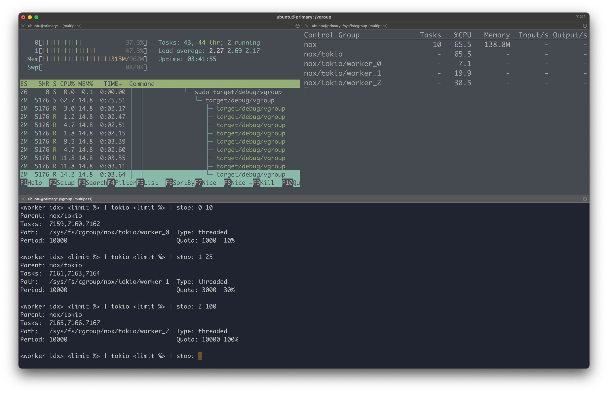

# What is this

This is an attempt to befriend both Cgroups v2 and Tokio Threads.

This project creates a bunch of threads, puts them into 3 groups, and creates a Cgroup for each of them.

Then, it limits CPU utilization by using Threaded CPU Controller from Cgroup v2

# How to run

You will need a Cgroup v2 capable Linux.

Since I use MacOS, I use `multipass` to run Linuxes.

Also, the program would need root privileges to write to `/sys/fs/cgroup`.

```shell
cargo build && sudo "target/debug/vgroup"
```

# What it looks like



# Example output

```shell
# nox:
Parent: no parent
Tasks:  no tasks
Path:   /sys/fs/cgroup/nox                 Type: domain threaded
Period: 100000                             Quota: -1	no limit

# tokio:
Parent: nox
Tasks:  no tasks
Path:   /sys/fs/cgroup/nox/tokio           Type: threaded
Period: 10000                              Quota: 20000	200%

Threads: 9
thread started: 7159
thread started: 7160
thread started: 7162
thread started: 7163
thread started: 7161
thread started: 7164
thread started: 7165
thread started: 7166
thread started: 7167
created threads [7159, 7160, 7162, 7163, 7161, 7164, 7165, 7166, 7167]
threads in 'nox/tokio/worker_0' cgroup: [7159, 7160, 7162]
threads in 'nox/tokio/worker_1' cgroup: [7161, 7163, 7164]
threads in 'nox/tokio/worker_2' cgroup: [7165, 7166, 7167]
<worker idx> <limit %> | tokio <limit %> | stop: tokio 100
Parent: nox
Tasks:  no tasks
Path:   /sys/fs/cgroup/nox/tokio           Type: threaded
Period: 10000                              Quota: 10000	100%

<worker idx> <limit %> | tokio <limit %> | stop: 0 10
Parent: nox/tokio
Tasks:  7159,7160,7162
Path:   /sys/fs/cgroup/nox/tokio/worker_0  Type: threaded
Period: 10000                              Quota: 1000	10%

<worker idx> <limit %> | tokio <limit %> | stop: 1 25
Parent: nox/tokio
Tasks:  7161,7163,7164
Path:   /sys/fs/cgroup/nox/tokio/worker_1  Type: threaded
Period: 10000                              Quota: 3000	30%

<worker idx> <limit %> | tokio <limit %> | stop: 2 100
Parent: nox/tokio
Tasks:  7165,7166,7167
Path:   /sys/fs/cgroup/nox/tokio/worker_2  Type: threaded
Period: 10000                              Quota: 10000	100%

<worker idx> <limit %> | tokio <limit %> | stop: stop
will stop.
thread stopped: 7167
thread stopped: 7163
thread stopped: 7166
thread stopped: 7165
thread stopped: 7161
thread stopped: 7164
thread stopped: 7160
thread stopped: 7162
thread stopped: 7159
Done.
```